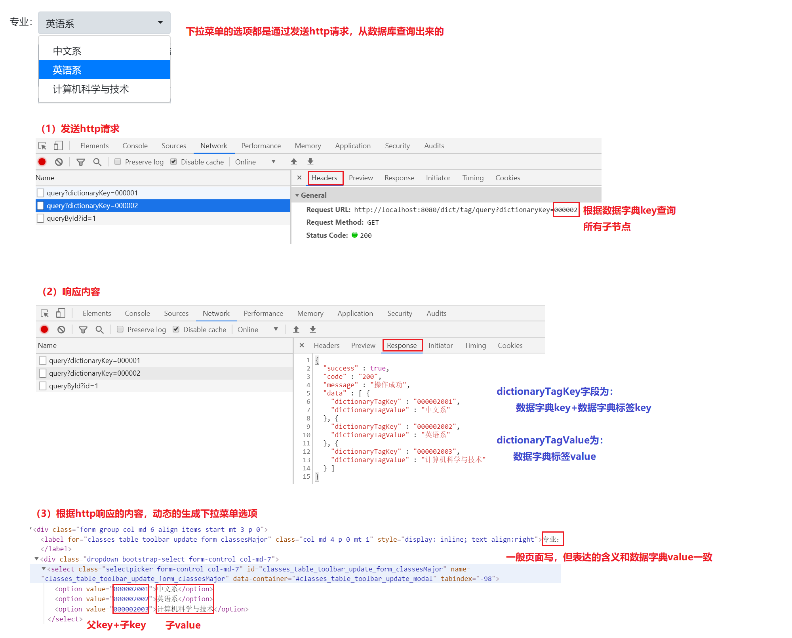

# 学生宿舍管理系统

## 项目目标

+ 复习数据库相关知识：数据库设计、基本CRUD操作，关联查询操作，JDBC操作
+ 复习Servlet处理HTTP请求
+ 复习HTTP相关知识：请求方法、响应状态码、数据类型等
+ 学习项目开发流程

## 开发环境与技术栈

+ Windows/Mac/Linux
+ Maven
+ Servlet
+ MySQL
+ Jackson

## 项目功能

主要业务：管理学校宿舍信息，记录并管理学生住宿信息

+ 用户注册（可屏蔽不实现）
+ 用户登录、会话管理
+ 用户信息管理（可不实现）
+ 宿舍楼管理（可不实现）
+ 寝室管理（可不实现）
+ 学生住宿管理（可实现部分）

## 项目演示

### 用户登录


### 用户管理（可不实现）

+ 查询用户列表


+ 新增用户


+ 修改用户


+ 删除用户


### 宿舍楼管理（略，类似用户管理）

### 寝室管理（略，类似用户管理）

### 学生住宿管理

+ 学生住宿信息查询


+ 新增学生住宿信息


+ 修改学生住宿信息


+ 删除学生住宿信息


+ 分配学生宿舍


## 数据库设计

### 数据库表关系图


以上关系可见：

1. 宿舍楼和寝室为一对多关系
2. 寝室和学生信息表为一对多关系
5. 数据字典表和数据字典标签表为一对多关系

### 字典表说明

数据字典表和数据字典标签表主要用在一些通用的下拉菜单选项。

如班级表中的字段：学生是哪一届的，学生专业

+ 如果单独设计需要单独一张表，实际存放的数据也不会太多，可以考虑设计在整体的一张表。
+ 页面上展示时，这些字段也是下拉选项。
+ 一般在设计上考虑为两张表：数据字典表和数据字典标签表（一对多关系）来保存。两张表都是key、value的形式，字典表是父节点，字典标签表是子节点，下拉菜单通过父节点的key查询出所有关联的子节点，再使用子节点的key、value进行下拉菜单选项的初始化

比如一个下拉菜单，页面元素-接口请求/响应-数据库关系如下：



### 创建数据库及表

```mysql
drop database if exists stu_dorm;
create database stu_dorm character set utf8mb4;

use stu_dorm;

drop table if exists user;
create table user(
    id int primary key auto_increment,
    username varchar(20) not null unique comment '用户账号',
    password varchar(20) not null comment '密码',
    nickname varchar(20) comment '用户昵称',
    email varchar(50) comment '邮箱',
    create_time timestamp default NOW() comment '创建时间'
) comment '用户表';

drop table if exists building;
create table building(
    id int primary key auto_increment,
    building_name varchar(20) not null unique comment '名称',
    building_desc varchar(50) comment '描述',
    create_time timestamp default NOW() comment '创建时间'
) comment '宿舍楼';

drop table if exists dorm;
create table dorm(
    id int primary key auto_increment,
    dorm_no varchar(20) not null comment '房号',
    dorm_desc varchar(50) comment '描述',
    building_id int comment '宿舍楼id',
    create_time timestamp default NOW() comment '创建时间',
    foreign key (building_id) references building(id)
) comment '寝室';

drop table if exists dictionary;
create table dictionary(
    id int primary key auto_increment,
    dictionary_key varchar(20) not null unique comment '键',
    dictionary_value varchar(20) not null comment '值',
    dictionary_desc varchar(20) comment '描述',
    create_time timestamp default NOW() comment '创建时间'
) comment '数据字典';

drop table if exists dictionary_tag;
create table dictionary_tag(
    id int primary key auto_increment,
    dictionary_tag_key varchar(20) not null comment '键',
    dictionary_tag_value varchar(20) not null comment '值',
    dictionary_tag_desc varchar(20) comment '描述',
    dictionary_id int comment '数据字典id',
    create_time timestamp default NOW() comment '创建时间',
    foreign key (dictionary_id) references dictionary(id)
) comment '数据字典标签';

drop table if exists student;
create table student(
    id int primary key auto_increment,
    student_name varchar(20) not null comment '姓名',
    student_graduate_year varchar(20) comment '毕业年份，数据字典000001',
    student_major varchar(20) comment '专业，数据字典000002',
    student_email varchar(50) comment '邮箱',
    dorm_id int comment '宿舍id',
    create_time timestamp default NOW() comment '创建时间',
    foreign key (dorm_id) references dorm(id)
) comment '学生表';
```
初始化数据
```mysql
use stu_dorm;
-- 初始化数据
-- mysql中没有==，是用=号代替==。为了区分=和==，赋值时使用:=
-- 初始化数据
-- mysql中没有==，是用=号代替==。为了区分=和==，赋值时使用:=
set @username:='abc';
set @password:='123';
set @nickname:='风一样的男子😱';
set @email:='123@qq.com';

set @building_name:='生楼-';
set @building_desc:='修炼道场(⓿_⓿)';

set @dorm_desc:='闭关之地( ఠൠఠ )ﾉ';

set @dictionary_student_graduate_year='000001';
set @dictionary_student_major='000002';

set @student_name:='小小的梦想🐷';

insert into user(username, nickname, password, email) values (@username, @nickname, @password, @email);
insert into user(username, nickname, password, email) values (concat(@username, '1'), concat(@nickname, '1'), @password, @email);
insert into user(username, nickname, password, email) values (concat(@username, '2'), concat(@nickname, '2'), @password, @email);
insert into user(username, nickname, password, email) values (concat(@username, '3'), concat(@nickname, '3'), @password, @email);
insert into user(username, nickname, password, email) values (concat(@username, '4'), concat(@nickname, '4'), @password, @email);
insert into user(username, nickname, password, email) values (concat(@username, '5'), concat(@nickname, '5'), @password, @email);

insert into building(building_name, building_desc) values (concat('男', @building_name, '1'), @building_desc);
insert into building(building_name, building_desc) values (concat('男', @building_name, '2'), @building_desc);
insert into building(building_name, building_desc) values (concat('男', @building_name, '3'), @building_desc);
insert into building(building_name, building_desc) values (concat('女', @building_name, '1'), @building_desc);
insert into building(building_name, building_desc) values (concat('女', @building_name, '2'), @building_desc);
insert into building(building_name, building_desc) values (concat('女', @building_name, '3'), @building_desc);

## 宿舍
# 宿舍楼1的宿舍
insert into dorm(dorm_no, dorm_desc, building_id) values ('1-0-1', @dorm_desc, 1);
insert into dorm(dorm_no, dorm_desc, building_id) values ('1-0-2', @dorm_desc, 1);
insert into dorm(dorm_no, dorm_desc, building_id) values ('1-0-3', @dorm_desc, 1);
# 宿舍楼2的宿舍
insert into dorm(dorm_no, dorm_desc, building_id) values ('2-0-1', @dorm_desc, 2);
insert into dorm(dorm_no, dorm_desc, building_id) values ('2-0-2', @dorm_desc, 2);
insert into dorm(dorm_no, dorm_desc, building_id) values ('2-0-3', @dorm_desc, 2);
# 宿舍楼3的宿舍
insert into dorm(dorm_no, dorm_desc, building_id) values ('3-0-1', @dorm_desc, 3);
insert into dorm(dorm_no, dorm_desc, building_id) values ('3-0-2', @dorm_desc, 3);
insert into dorm(dorm_no, dorm_desc, building_id) values ('3-0-3', @dorm_desc, 3);
# 宿舍楼4的宿舍
insert into dorm(dorm_no, dorm_desc, building_id) values ('4-0-1', @dorm_desc, 4);
insert into dorm(dorm_no, dorm_desc, building_id) values ('4-0-2', @dorm_desc, 4);
insert into dorm(dorm_no, dorm_desc, building_id) values ('4-0-3', @dorm_desc, 4);

## 数据字典：学生毕业年份
insert into dictionary(dictionary_key, dictionary_value, dictionary_desc)values (@dictionary_student_graduate_year, '毕业年份', '学生毕业的年份');

insert into dictionary_tag(dictionary_tag_key, dictionary_tag_value, dictionary_id)values ('001', '2020届', 1);
insert into dictionary_tag(dictionary_tag_key, dictionary_tag_value, dictionary_id)values ('002', '2021届', 1);
insert into dictionary_tag(dictionary_tag_key, dictionary_tag_value, dictionary_id)values ('003', '2022届', 1);
insert into dictionary_tag(dictionary_tag_key, dictionary_tag_value, dictionary_id)values ('004', '2023届', 1);

## 数据字典：学生专业
insert into dictionary(dictionary_key, dictionary_value, dictionary_desc)values (@dictionary_student_major, '专业', '学生的专业');
insert into dictionary_tag(dictionary_tag_key, dictionary_tag_value, dictionary_id)values ('001', '中文系', 2);
insert into dictionary_tag(dictionary_tag_key, dictionary_tag_value, dictionary_id)values ('002', '英语系', 2);
insert into dictionary_tag(dictionary_tag_key, dictionary_tag_value, dictionary_id)values ('003', '计算机科学与技术', 2);

insert into student(student_name, student_graduate_year, student_major, student_email, dorm_id) values (concat(@student_name, 'A1'), '000001001', '000002001', @email, 1);
insert into student(student_name, student_graduate_year, student_major, student_email, dorm_id) values (concat(@student_name, 'A2'), '000001001', '000002001', @email, 1);
insert into student(student_name, student_graduate_year, student_major, student_email, dorm_id) values (concat(@student_name, 'A3'), '000001001', '000002001', @email, 1);
insert into student(student_name, student_graduate_year, student_major, student_email, dorm_id) values (concat(@student_name, 'A4'), '000001001', '000002001', @email, 1);
insert into student(student_name, student_graduate_year, student_major, student_email, dorm_id) values (concat(@student_name, 'A5'), '000001001', '000002001', @email, 1);
insert into student(student_name, student_graduate_year, student_major, student_email, dorm_id) values (concat(@student_name, 'B1'), '000001001', '000002002', @email, 2);
insert into student(student_name, student_graduate_year, student_major, student_email, dorm_id) values (concat(@student_name, 'B2'), '000001001', '000002002', @email, 2);
insert into student(student_name, student_graduate_year, student_major, student_email, dorm_id) values (concat(@student_name, 'B3'), '000001001', '000002002', @email, 2);
insert into student(student_name, student_graduate_year, student_major, student_email, dorm_id) values (concat(@student_name, 'B4'), '000001001', '000002002', @email, 2);
insert into student(student_name, student_graduate_year, student_major, student_email, dorm_id) values (concat(@student_name, 'B5'), '000001001', '000002002', @email, 2);
insert into student(student_name, student_graduate_year, student_major, student_email, dorm_id) values (concat(@student_name, 'C1'), '000001001', '000002003', @email, 3);
insert into student(student_name, student_graduate_year, student_major, student_email, dorm_id) values (concat(@student_name, 'C2'), '000001001', '000002003', @email, 3);
insert into student(student_name, student_graduate_year, student_major, student_email, dorm_id) values (concat(@student_name, 'C3'), '000001001', '000002003', @email, 3);
insert into student(student_name, student_graduate_year, student_major, student_email, dorm_id) values (concat(@student_name, 'C4'), '000001001', '000002003', @email, 3);
insert into student(student_name, student_graduate_year, student_major, student_email, dorm_id) values (concat(@student_name, 'C5'), '000001001', '000002003', @email, 3);
insert into student(student_name, student_graduate_year, student_major, student_email, dorm_id) values (concat(@student_name, 'D1'), '000001002', '000002001', @email, 4);
insert into student(student_name, student_graduate_year, student_major, student_email, dorm_id) values (concat(@student_name, 'D2'), '000001002', '000002001', @email, 4);
insert into student(student_name, student_graduate_year, student_major, student_email, dorm_id) values (concat(@student_name, 'D3'), '000001002', '000002001', @email, 4);
insert into student(student_name, student_graduate_year, student_major, student_email, dorm_id) values (concat(@student_name, 'D4'), '000001002', '000002001', @email, 4);
insert into student(student_name, student_graduate_year, student_major, student_email, dorm_id) values (concat(@student_name, 'D5'), '000001002', '000002001', @email, 4);
insert into student(student_name, student_graduate_year, student_major, student_email, dorm_id) values (concat(@student_name, 'E1'), '000001002', '000002002', @email, 5);
insert into student(student_name, student_graduate_year, student_major, student_email, dorm_id) values (concat(@student_name, 'E2'), '000001002', '000002002', @email, 5);
insert into student(student_name, student_graduate_year, student_major, student_email, dorm_id) values (concat(@student_name, 'E3'), '000001002', '000002002', @email, 5);
insert into student(student_name, student_graduate_year, student_major, student_email, dorm_id) values (concat(@student_name, 'E4'), '000001002', '000002002', @email, 5);
insert into student(student_name, student_graduate_year, student_major, student_email, dorm_id) values (concat(@student_name, 'E5'), '000001002', '000002002', @email, 5);
insert into student(student_name, student_graduate_year, student_major, student_email, dorm_id) values (concat(@student_name, 'F1'), '000001002', '000002003', @email, 6);
insert into student(student_name, student_graduate_year, student_major, student_email, dorm_id) values (concat(@student_name, 'F2'), '000001002', '000002003', @email, 6);
insert into student(student_name, student_graduate_year, student_major, student_email, dorm_id) values (concat(@student_name, 'F3'), '000001002', '000002003', @email, 6);
insert into student(student_name, student_graduate_year, student_major, student_email, dorm_id) values (concat(@student_name, 'F4'), '000001002', '000002003', @email, 6);
insert into student(student_name, student_graduate_year, student_major, student_email, dorm_id) values (concat(@student_name, 'F5'), '000001002', '000002003', @email, 6);
insert into student(student_name, student_graduate_year, student_major, student_email, dorm_id) values (concat(@student_name, 'G1'), '000001003', '000002001', @email, 7);
insert into student(student_name, student_graduate_year, student_major, student_email, dorm_id) values (concat(@student_name, 'G2'), '000001003', '000002001', @email, 7);
insert into student(student_name, student_graduate_year, student_major, student_email, dorm_id) values (concat(@student_name, 'G3'), '000001003', '000002001', @email, 7);
insert into student(student_name, student_graduate_year, student_major, student_email, dorm_id) values (concat(@student_name, 'G4'), '000001003', '000002001', @email, 7);
insert into student(student_name, student_graduate_year, student_major, student_email, dorm_id) values (concat(@student_name, 'G5'), '000001003', '000002001', @email, 7);
insert into student(student_name, student_graduate_year, student_major, student_email, dorm_id) values (concat(@student_name, 'H1'), '000001003', '000002002', @email, 8);
insert into student(student_name, student_graduate_year, student_major, student_email, dorm_id) values (concat(@student_name, 'H2'), '000001003', '000002002', @email, 8);
insert into student(student_name, student_graduate_year, student_major, student_email, dorm_id) values (concat(@student_name, 'H3'), '000001003', '000002002', @email, 8);
insert into student(student_name, student_graduate_year, student_major, student_email, dorm_id) values (concat(@student_name, 'H4'), '000001003', '000002002', @email, 8);
insert into student(student_name, student_graduate_year, student_major, student_email, dorm_id) values (concat(@student_name, 'H5'), '000001003', '000002002', @email, 8);
insert into student(student_name, student_graduate_year, student_major, student_email, dorm_id) values (concat(@student_name, 'I1'), '000001003', '000002003', @email, 9);
insert into student(student_name, student_graduate_year, student_major, student_email, dorm_id) values (concat(@student_name, 'I2'), '000001003', '000002003', @email, 9);
insert into student(student_name, student_graduate_year, student_major, student_email, dorm_id) values (concat(@student_name, 'I3'), '000001003', '000002003', @email, 9);
insert into student(student_name, student_graduate_year, student_major, student_email, dorm_id) values (concat(@student_name, 'I4'), '000001003', '000002003', @email, 9);
insert into student(student_name, student_graduate_year, student_major, student_email, dorm_id) values (concat(@student_name, 'I5'), '000001003', '000002003', @email, 9);
insert into student(student_name, student_graduate_year, student_major, student_email, dorm_id) values (concat(@student_name, 'J1'), '000001004', '000002001', @email, 10);
insert into student(student_name, student_graduate_year, student_major, student_email, dorm_id) values (concat(@student_name, 'J2'), '000001004', '000002001', @email, 10);
insert into student(student_name, student_graduate_year, student_major, student_email, dorm_id) values (concat(@student_name, 'J3'), '000001004', '000002001', @email, 10);
insert into student(student_name, student_graduate_year, student_major, student_email, dorm_id) values (concat(@student_name, 'J4'), '000001004', '000002001', @email, 10);
insert into student(student_name, student_graduate_year, student_major, student_email, dorm_id) values (concat(@student_name, 'J5'), '000001004', '000002001', @email, 10);
insert into student(student_name, student_graduate_year, student_major, student_email, dorm_id) values (concat(@student_name, 'K1'), '000001004', '000002002', @email, 11);
insert into student(student_name, student_graduate_year, student_major, student_email, dorm_id) values (concat(@student_name, 'K2'), '000001004', '000002002', @email, 11);
insert into student(student_name, student_graduate_year, student_major, student_email, dorm_id) values (concat(@student_name, 'K3'), '000001004', '000002002', @email, 11);
insert into student(student_name, student_graduate_year, student_major, student_email, dorm_id) values (concat(@student_name, 'K4'), '000001004', '000002002', @email, 11);
insert into student(student_name, student_graduate_year, student_major, student_email, dorm_id) values (concat(@student_name, 'K5'), '000001004', '000002002', @email, 11);
insert into student(student_name, student_graduate_year, student_major, student_email, dorm_id) values (concat(@student_name, 'L1'), '000001004', '000002003', @email, 12);
insert into student(student_name, student_graduate_year, student_major, student_email, dorm_id) values (concat(@student_name, 'L2'), '000001004', '000002003', @email, 12);
insert into student(student_name, student_graduate_year, student_major, student_email, dorm_id) values (concat(@student_name, 'L3'), '000001004', '000002003', @email, 12);
insert into student(student_name, student_graduate_year, student_major, student_email, dorm_id) values (concat(@student_name, 'L4'), '000001004', '000002003', @email, 12);
insert into student(student_name, student_graduate_year, student_major, student_email, dorm_id) values (concat(@student_name, 'L5'), '000001004', '000002003', @email, 12);
```

## 前后端接口

要实现功能，需要先明确前后端约定好的接口，我们主要实现图书借阅信息管理，所以只实现该业务相关接口。

需要说明的是，接口的定义一般是前后端约定好的，所以也和前端代码息息相关，前端需要什么数据，需要什么格式的数据，也会在接口中体现。

### 查询专业字典

请求

```
GET dict/tag/query?dictionaryKey=000002
```

响应

```json
{
  "success" : true,
  "code" : "200",
  "message" : "操作成功",
  "data" : [ {
    "dictionaryTagKey" : "000002001",
    "dictionaryTagValue" : "中文系"
  }, {
    "dictionaryTagKey" : "000002002",
    "dictionaryTagValue" : "英语系"
  }, {
    "dictionaryTagKey" : "000002003",
    "dictionaryTagValue" : "计算机科学与技术"
  } ]
}
```

### 查询毕业年份字典

请求

```
GET dict/tag/query?dictionaryKey=000001
```

响应

```json
{
  "success" : true,
  "code" : "200",
  "message" : "操作成功",
  "data" : [ {
    "dictionaryTagKey" : "000001001",
    "dictionaryTagValue" : "2020届"
  }, {
    "dictionaryTagKey" : "000001002",
    "dictionaryTagValue" : "2021届"
  }, {
    "dictionaryTagKey" : "000001003",
    "dictionaryTagValue" : "2022届"
  }, {
    "dictionaryTagKey" : "000001004",
    "dictionaryTagValue" : "2023届"
  } ]
}
```

### 查询学生住宿信息

请求

```
GET student/query?searchText=&sortOrder=asc&pageSize=7&pageNumber=1&_=1594084296034
```

响应

```json
{
  "success" : true,
  "code" : "200",
  "message" : "操作成功",
  "total" : 60,
  "data" : [ {
    "id" : 1,
    "studentName" : "小小的梦想\uD83D\uDC37A1",
    "studentGraduateYear" : "000001001",
    "studentMajor" : "000002001",
    "studentEmail" : "123@qq.com",
    "dormId" : 1,
    "createTime" : "2020-06-16 15:29:25",
    "buildingId" : "1",
    "buildingName" : "男生楼-1",
    "dormNo" : "1-0-1"
  }, {
    "id" : 2,
    "studentName" : "小小的梦想\uD83D\uDC37A2",
    "studentGraduateYear" : "000001001",
    "studentMajor" : "000002001",
    "studentEmail" : "123@qq.com",
    "dormId" : 1,
    "createTime" : "2020-06-16 15:29:25",
    "buildingId" : "1",
    "buildingName" : "男生楼-1",
    "dormNo" : "1-0-1"
  }, {
    "id" : 3,
    "studentName" : "小小的梦想\uD83D\uDC37A3",
    "studentGraduateYear" : "000001001",
    "studentMajor" : "000002001",
    "studentEmail" : "123@qq.com",
    "dormId" : 1,
    "createTime" : "2020-06-16 15:29:25",
    "buildingId" : "1",
    "buildingName" : "男生楼-1",
    "dormNo" : "1-0-1"
  }, {
    "id" : 4,
    "studentName" : "小小的梦想\uD83D\uDC37A4",
    "studentGraduateYear" : "000001001",
    "studentMajor" : "000002001",
    "studentEmail" : "123@qq.com",
    "dormId" : 1,
    "createTime" : "2020-06-16 15:29:25",
    "buildingId" : "1",
    "buildingName" : "男生楼-1",
    "dormNo" : "1-0-1"
  }, {
    "id" : 5,
    "studentName" : "小小的梦想\uD83D\uDC37A5",
    "studentGraduateYear" : "000001001",
    "studentMajor" : "000002001",
    "studentEmail" : "123@qq.com",
    "dormId" : 1,
    "createTime" : "2020-06-16 15:29:25",
    "buildingId" : "1",
    "buildingName" : "男生楼-1",
    "dormNo" : "1-0-1"
  }, {
    "id" : 6,
    "studentName" : "小小的梦想\uD83D\uDC37B1",
    "studentGraduateYear" : "000001001",
    "studentMajor" : "000002002",
    "studentEmail" : "123@qq.com",
    "dormId" : 2,
    "createTime" : "2020-06-16 15:29:25",
    "buildingId" : "1",
    "buildingName" : "男生楼-1",
    "dormNo" : "1-0-2"
  }, {
    "id" : 7,
    "studentName" : "小小的梦想\uD83D\uDC37B2",
    "studentGraduateYear" : "000001001",
    "studentMajor" : "000002002",
    "studentEmail" : "123@qq.com",
    "dormId" : 2,
    "createTime" : "2020-06-16 15:29:25",
    "buildingId" : "1",
    "buildingName" : "男生楼-1",
    "dormNo" : "1-0-2"
  } ]
}
```

### 查询宿舍楼（数据字典）

使用在下拉菜单中，要求按照数据字典响应格式返回

请求
```
GET building/queryAsDict
```

响应
```json
{
  "success" : true,
  "code" : "200",
  "message" : "操作成功",
  "data" : [ {
    "dictionaryTagKey" : "4",
    "dictionaryTagValue" : "女生楼-1"
  }, {
    "dictionaryTagKey" : "5",
    "dictionaryTagValue" : "女生楼-2"
  }, {
    "dictionaryTagKey" : "6",
    "dictionaryTagValue" : "女生楼-3"
  }, {
    "dictionaryTagKey" : "1",
    "dictionaryTagValue" : "男生楼-1"
  }, {
    "dictionaryTagKey" : "2",
    "dictionaryTagValue" : "男生楼-2"
  }, {
    "dictionaryTagKey" : "3",
    "dictionaryTagValue" : "男生楼-3"
  } ]
}
```

### 查询寝室（数据字典）

级联下拉菜单：选择宿舍楼下拉选项之后，根据选择的宿舍楼id查询所有寝室。要求按照数据字典响应格式返回

请求

```
GET dorm/queryAsDict?dictionaryKey=4
```

响应

```json
{
  "success" : true,
  "code" : "200",
  "message" : "操作成功",
  "data" : [ {
    "dictionaryTagKey" : "10",
    "dictionaryTagValue" : "4-0-1"
  }, {
    "dictionaryTagKey" : "11",
    "dictionaryTagValue" : "4-0-2"
  }, {
    "dictionaryTagKey" : "12",
    "dictionaryTagValue" : "4-0-3"
  } ]
}
```

### 新增学生住宿信息

请求

```
POST student/add
Content-Type: application/json

{"studentName":"我是谁","studentGraduateYear":"000001003","studentMajor":"000002002","studentEmail":"","buildingId":"1","dormId":"1"}
```

响应

```json
{
  "success" : true,
  "code" : "200",
  "message" : "操作成功"
}
```

### 删除学生住宿信息

请求

```
GET student/delete?ids=2&ids=3
```

响应

```json
{
  "success" : true,
  "code" : "200",
  "message" : "操作成功"
}
```

### 查询学生住宿详情

请求

```
GET student/queryById?id=1
```

响应

```json
{
  "success" : true,
  "code" : "200",
  "message" : "操作成功",
  "data" : {
    "id" : 1,
    "studentName" : "小小的梦想\uD83D\uDC37A1",
    "studentGraduateYear" : "000001001",
    "studentMajor" : "000002001",
    "studentEmail" : "123@qq.com",
    "dormId" : 1,
    "createTime" : "2020-06-16 15:29:25",
    "buildingId" : "1",
    "buildingName" : "男生楼-1",
    "dormNo" : "1-0-1"
  }
}
```

### 修改学生住宿信息

请求

```
POST student/update
Content-Type: application/json

{"id":"1","studentName":"小小的梦想🐷A1","studentGraduateYear":"000001003","studentMajor":"000002003","studentEmail":"123@qq.com","buildingId":"3","dormId":"8"}
```

响应

```json
{
  "success" : true,
  "code" : "200",
  "message" : "操作成功"
}
```

### 分配学生住宿信息

请求

```
POST student/apply
Content-Type: application/json

{"ids":["4","5"],"buildingId":"1","dormId":"1"}
```

响应

```json
{
  "success" : true,
  "code" : "200",
  "message" : "操作成功"
}
```

## 开发环境准备

### Maven环境配置

#### 1. 下载文件

下载上传的settings.xml文件和本地仓库压缩包M2Repository.zip，确保存放在本地某个路径中，之后别移动了。并解压压缩包，解压后是这样的：


#### 2. 打开配置面板


#### 3. IDEA配置Maven


### IDEA其他配置

参考课件《15. IDEA配置.pdf》，要求项目及IDEA配置部分内容全部完成。

提前安装lombok插件：

在IDEA File -> settings -> plugins，输入lombok搜索。有时候网络原因，可能搜索不到，退出重新进入再次搜索，多操作几次。搜索到了点击install安装插件，安装完成后重启IDEA。

### 配置项目pom.xml

```xml
<?xml version="1.0" encoding="UTF-8"?>
<project xmlns="http://maven.apache.org/POM/4.0.0"
         xmlns:xsi="http://www.w3.org/2001/XMLSchema-instance"
         xsi:schemaLocation="http://maven.apache.org/POM/4.0.0 http://maven.apache.org/xsd/maven-4.0.0.xsd">
    <modelVersion>4.0.0</modelVersion>

    <groupId>frank</groupId>
    <artifactId>book-sys</artifactId>
    <version>1.0-SNAPSHOT</version>
    <packaging>war</packaging>

    <dependencies>

        <!-- MySQL数据库JDBC驱动包 -->
        <dependency>
            <groupId>mysql</groupId>
            <artifactId>mysql-connector-java</artifactId>
            <version>5.1.38</version>
        </dependency>

        <!-- javaee web依赖包：运行时由web容器提供，
            包括：WebSocket 1.1, JSON Binding 1.0, JSON Processing 1.1,
            Servlet 4.0, JavaServer Faces 2.3, Expression Language  3.0,
            JavaServer Pages(JSP) 2.3, JSTL 1.2 -->
        <dependency>
            <groupId>javax</groupId>
            <artifactId>javaee-web-api</artifactId>
            <version>8.0.1</version>
            <scope>provided</scope>
        </dependency>

        <!-- Lombok: 自动插入编辑器并构建工具，以注解的方式，简化一些模版代码的编写，
                    如getter/setter方法、equals/hashcode方法、toString方法等-->
        <dependency>
            <groupId>org.projectlombok</groupId>
            <artifactId>lombok</artifactId>
            <version>1.18.8</version>
            <scope>provided</scope>
        </dependency>

        <!-- JUnit: java的一种测试框架 -->
        <dependency>
            <groupId>junit</groupId>
            <artifactId>junit</artifactId>
            <version>4.12</version>
            <scope>test</scope>
        </dependency>

        <!-- jackson core: 基础核心包-->
        <dependency>
            <groupId>com.fasterxml.jackson.core</groupId>
            <artifactId>jackson-core</artifactId>
            <version>2.8.9</version>
        </dependency>

        <!--jackson databind: 数据绑定包，提供Java对象与JSON数据格式进行序列化
                   及反序列化的支持 -->
        <dependency>
            <groupId>com.fasterxml.jackson.core</groupId>
            <artifactId>jackson-databind</artifactId>
            <version>2.8.9</version>
        </dependency>

        <!-- jackson annotations: 为Jackson数据绑定包提供的注解支持 -->
        <dependency>
            <groupId>com.fasterxml.jackson.core</groupId>
            <artifactId>jackson-annotations</artifactId>
            <version>2.9.0</version>
        </dependency>

    </dependencies>

    <build>
        <!-- 打包后的包名（和我们部署的项目名一致） -->
        <finalName>bs</finalName>
        <plugins>
            <plugin>
                <artifactId>maven-compiler-plugin</artifactId>
                <configuration>
                    <source>1.8</source>
                    <target>1.8</target>
                    <encoding>UTF-8</encoding>
                </configuration>
            </plugin>
        </plugins>
    </build>
</project>
```

### 准备前端资源

## 代码设计

### 设计数据库实体类

### 设计http请求基类

主要针对前端表格中，可以输入文本搜索，并根据页码显示列表数据

```java
import lombok.Getter;
import lombok.Setter;

@Getter
@Setter
public class BaseEntity {

    private Integer pageNumber;

    private Integer pageSize;

    private String searchText;

    private String sortOrder;
}

```

### 设计统一响应类

```java
import com.github.pagehelper.Page;
import lombok.Getter;
import lombok.Setter;
import lombok.ToString;

import java.io.PrintWriter;
import java.io.StringWriter;

@Getter
@Setter
@ToString
public class ResponseResult {

    private boolean success;

    private String code;

    private String message;

    private Long total;

    private Object data;

    private String stackTrace;
}
```

### 设计工具类

## 可扩展部分

### 功能上其他面板中的功能都可以实现

### session及权限校验可以考虑使用过滤器实现