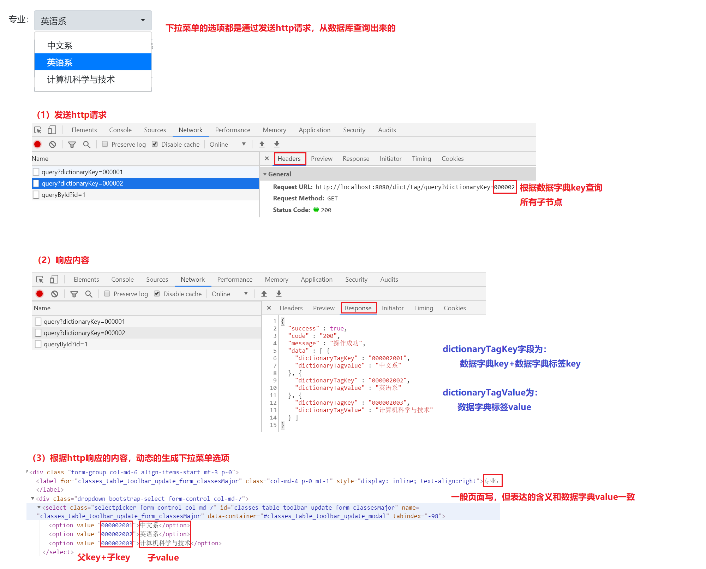

# 学生成绩管理系统

## 项目目标

+ 复习数据库相关知识：数据库设计、基本CRUD操作，关联查询操作，JDBC操作
+ 复习Servlet处理HTTP请求
+ 复习HTTP相关知识：请求方法、响应状态码、数据类型等
+ 学习项目开发流程

## 开发环境与技术栈

+ Windows/Mac/Linux
+ Maven
+ Servlet
+ MySQL
+ Jackson

## 项目功能

主要业务：管理学生考试信息，记录并管理学生考试成绩

+ 用户注册（可屏蔽不实现）
+ 用户登录、会话管理
+ 用户信息管理（可不实现）
+ 班级信息管理（可不实现）
+ 课程信息管理（可不实现）
+ 学生信息管理（可不实现）
+ 考试管理（可不实现）
+ 考试成绩管理（可实现部分）

## 项目演示

### 用户登录


### 用户管理（可不实现）

+ 查询用户列表


+ 新增用户


+ 修改用户


+ 删除用户


### 班级管理（略，类似用户管理）

### 课程管理（略，类似用户管理）

### 学生管理（略，类似用户管理）

### 考试管理（略，类似用户管理）

### 考试成绩管理

+ 考试成绩查询


+ 新增考试成绩


+ 修改考试成绩


+ 删除考试成绩


## 数据库设计
### 数据库表关系图


以上关系可见：

1. 学生表和班级表为多对一关系
2. 考试表和班级表为多对一关系
3. 考试表和课程表为多对一关系
4. 学生表和学生考试记录表为一对多关系
5. 考试表和学生考试记录表为一对多关系
6. 由2和3可知，考试表和学生表在考试的场景下，表现出多对多关系
7. 数据字典表和数据字典标签表为一对多关系

### 字典表说明

数据字典表和数据字典标签表主要用在一些通用的下拉菜单选项。

如班级表中的字段：学生是哪一届的，学生专业

+ 如果单独设计需要单独一张表，实际存放的数据也不会太多，可以考虑设计在整体的一张表。
+ 页面上展示时，这些字段也是下拉选项。
+ 一般在设计上考虑为两张表：数据字典表和数据字典标签表（一对多关系）来保存。两张表都是key、value的形式，字典表是父节点，字典标签表是子节点，下拉菜单通过父节点的key查询出所有关联的子节点，再使用子节点的key、value进行下拉菜单选项的初始化

比如一个下拉菜单，页面元素-接口请求/响应-数据库关系如下：



### 创建数据库及表

```mysql
drop database if exists stu_exam;
create database stu_exam character set utf8mb4;

use stu_exam;

drop table if exists user;
create table user(
    id int primary key auto_increment,
    username varchar(20) not null unique comment '用户账号',
    password varchar(20) not null comment '密码',
    nickname varchar(20) comment '用户昵称',
    email varchar(50) comment '邮箱',
    create_time timestamp default NOW() comment '创建时间'
) comment '用户表';

drop table if exists dictionary;
create table dictionary(
    id int primary key auto_increment,
    dictionary_key varchar(20) not null unique comment '键',
    dictionary_value varchar(20) not null comment '值',
    dictionary_desc varchar(20) comment '备注',
    create_time timestamp default NOW() comment '创建时间'
) comment '数据字典';

drop table if exists dictionary_tag;
create table dictionary_tag(
    id int primary key auto_increment,
    dictionary_tag_key varchar(20) not null comment '键',
    dictionary_tag_value varchar(20) not null comment '值',
    dictionary_tag_desc varchar(20) comment '备注',
    dictionary_id int comment '数据字典id',
    create_time timestamp default NOW() comment '创建时间',
    foreign key (dictionary_id) references dictionary(id)
) comment '数据字典标签';

drop table if exists classes;
create table classes(
    id int primary key auto_increment,
    classes_name varchar(20) not null comment '班级名称',
    classes_graduate_year varchar(20) comment '毕业年份，数据字典000001',
    classes_major varchar(20) comment '专业，数据字典000002',
    classes_desc varchar(50) comment '备注',
    create_time timestamp default NOW() comment '创建时间'
) comment '班级表';

drop table if exists student;
create table student(
    id int primary key auto_increment,
    student_name varchar(20) not null comment '姓名',
    student_no varchar(20) comment '学号',
    id_card varchar(20) comment '身份证号',
    student_email varchar(50) comment '邮箱',
    classes_id int comment '班级id',
    create_time timestamp default NOW() comment '创建时间',
    foreign key (classes_id) references classes(id)
) comment '学生表';

drop table if exists course;
create table course(
   id int primary key auto_increment,
   course_name varchar(20) not null comment '课程名称',
   create_time timestamp default NOW() comment '创建时间'
) comment '课程信息';

drop table if exists exam;
create table exam(
    id int primary key auto_increment,
    exam_name varchar(20) not null comment '考试名称',
    exam_desc varchar(20) comment '考试备注',
    course_id int comment '课程id',
    classes_id int comment '班级id',
    create_time timestamp default NOW() comment '创建时间',
    foreign key (course_id) references course(id),
    foreign key (classes_id) references classes(id)
) comment '考试信息';

drop table if exists exam_record;
create table exam_record(
    id int primary key auto_increment,
    score decimal(4, 1) not null comment '考试成绩',
    student_id int comment '学生id',
    exam_id int comment '考试id',
    exam_record_desc varchar(200) comment '考试记录备注',
    create_time timestamp default NOW() comment '创建时间',
    foreign key (student_id) references student(id),
    foreign key (exam_id) references exam(id)
) comment '学生考试记录';
```
初始化数据
```mysql
-- 初始化数据
-- mysql中没有==，是用=号代替==。为了区分=和==，赋值时使用:=
set @username:='abc';
set @password:='123';
set @nickname:='风一样的男子😱';
set @email:='123@qq.com';

set @dictionary_classes_graduate_year='000001';
set @dictionary_classes_major='000002';

set @classes_name:='幼儿园😂';
set @student_name:='小小的梦想🐷';

insert into user(username, nickname, password, email) values (@username, @nickname, @password, @email);
insert into user(username, nickname, password, email) values (concat(@username, '1'), concat(@nickname, '1'), @password, @email);
insert into user(username, nickname, password, email) values (concat(@username, '2'), concat(@nickname, '2'), @password, @email);
insert into user(username, nickname, password, email) values (concat(@username, '3'), concat(@nickname, '3'), @password, @email);
insert into user(username, nickname, password, email) values (concat(@username, '4'), concat(@nickname, '4'), @password, @email);
insert into user(username, nickname, password, email) values (concat(@username, '5'), concat(@nickname, '5'), @password, @email);

## 数据字典：学生毕业年份
insert into dictionary(dictionary_key, dictionary_value, dictionary_desc)values (@dictionary_classes_graduate_year, '毕业年份', '学生毕业的年份');

insert into dictionary_tag(dictionary_tag_key, dictionary_tag_value, dictionary_id)values ('001', '2020届', 1);
insert into dictionary_tag(dictionary_tag_key, dictionary_tag_value, dictionary_id)values ('002', '2021届', 1);
insert into dictionary_tag(dictionary_tag_key, dictionary_tag_value, dictionary_id)values ('003', '2022届', 1);
insert into dictionary_tag(dictionary_tag_key, dictionary_tag_value, dictionary_id)values ('004', '2023届', 1);

## 数据字典：学生专业
insert into dictionary(dictionary_key, dictionary_value, dictionary_desc)values (@dictionary_classes_major, '专业', '学生的专业');
insert into dictionary_tag(dictionary_tag_key, dictionary_tag_value, dictionary_id)values ('001', '中文系', 2);
insert into dictionary_tag(dictionary_tag_key, dictionary_tag_value, dictionary_id)values ('002', '英语系', 2);
insert into dictionary_tag(dictionary_tag_key, dictionary_tag_value, dictionary_id)values ('003', '计算机科学与技术', 2);

insert into classes(classes_name, classes_graduate_year, classes_major, classes_desc) values (concat(@classes_name, '大班'), '000001001', '000002003', '已经4岁，即将成为大人的大班同学，不再是3岁小孩子了呀');
insert into classes(classes_name, classes_graduate_year, classes_major, classes_desc) values (concat(@classes_name, '中班'), '000001002', '000002003', '虽然还是3岁的小孩子，但也开始思考人生了呢');
insert into classes(classes_name, classes_graduate_year, classes_major, classes_desc) values (concat(@classes_name, '小班'), '000001003', '000002003', '挂着鼻涕的跟屁虫');

insert into student(student_name, student_no, id_card, student_email, classes_id) values (concat(@student_name, 'A1'), 's00001', '222222222222222222', @email, 1);
insert into student(student_name, student_no, id_card, student_email, classes_id) values (concat(@student_name, 'A2'), 's00002', '222222222222222223', @email, 1);
insert into student(student_name, student_no, id_card, student_email, classes_id) values (concat(@student_name, 'A3'), 's00003', '222222222222222224', @email, 1);
insert into student(student_name, student_no, id_card, student_email, classes_id) values (concat(@student_name, 'A4'), 's00004', '222222222222222225', @email, 1);
insert into student(student_name, student_no, id_card, student_email, classes_id) values (concat(@student_name, 'A5'), 's00005', '222222222222222226', @email, 1);
insert into student(student_name, student_no, id_card, student_email, classes_id) values (concat(@student_name, 'B1'), 's00006', '222222222222222227', @email, 2);
insert into student(student_name, student_no, id_card, student_email, classes_id) values (concat(@student_name, 'B2'), 's00007', '222222222222222228', @email, 2);
insert into student(student_name, student_no, id_card, student_email, classes_id) values (concat(@student_name, 'B3'), 's00008', '222222222222222229', @email, 2);
insert into student(student_name, student_no, id_card, student_email, classes_id) values (concat(@student_name, 'B4'), 's00009', '222222222222222230', @email, 2);
insert into student(student_name, student_no, id_card, student_email, classes_id) values (concat(@student_name, 'B5'), 's00010', '222222222222222231', @email, 2);

insert into course(course_name) values ('高等数学');
insert into course(course_name) values ('诗和远方');
insert into course(course_name) values ('柴米油盐');

insert into exam(exam_name, exam_desc, course_id, classes_id) values ('2018诗词鉴赏', '吟诗对唱愁愁愁', 1, 1);
insert into exam(exam_name, exam_desc, course_id, classes_id) values ('2019诗词鉴赏', '吟诗对唱愁愁愁', 2, 1);
insert into exam(exam_name, exam_desc, course_id, classes_id) values ('2020诗词鉴赏', '吟诗对唱愁愁愁', 3, 1);
insert into exam(exam_name, exam_desc, course_id, classes_id) values ('2018诗词鉴赏', '吟诗对唱愁愁愁', 1, 2);
insert into exam(exam_name, exam_desc, course_id, classes_id) values ('2019诗词鉴赏', '吟诗对唱愁愁愁', 2, 2);
insert into exam(exam_name, exam_desc, course_id, classes_id) values ('2020诗词鉴赏', '吟诗对唱愁愁愁', 3, 2);

insert into exam_record(score, student_id, exam_id, exam_record_desc) values (60, 1, 1, '没啥好说的，干就完事');
insert into exam_record(score, student_id, exam_id, exam_record_desc) values (61, 2, 1, '没啥好说的，干就完事');
insert into exam_record(score, student_id, exam_id, exam_record_desc) values (70, 3, 1, '没啥好说的，干就完事');
insert into exam_record(score, student_id, exam_id, exam_record_desc) values (71, 4, 1, '没啥好说的，干就完事');
insert into exam_record(score, student_id, exam_id, exam_record_desc) values (72, 5, 1, '没啥好说的，干就完事');
insert into exam_record(score, student_id, exam_id, exam_record_desc) values (73, 6, 4, '没啥好说的，干就完事');
insert into exam_record(score, student_id, exam_id, exam_record_desc) values (80, 7, 4, '没啥好说的，干就完事');
insert into exam_record(score, student_id, exam_id, exam_record_desc) values (81, 8, 4, '没啥好说的，干就完事');
insert into exam_record(score, student_id, exam_id, exam_record_desc) values (82, 9, 4, '没啥好说的，干就完事');
insert into exam_record(score, student_id, exam_id, exam_record_desc) values (83, 10, 4, '没啥好说的，干就完事');
insert into exam_record(score, student_id, exam_id, exam_record_desc) values (84, 1, 2, '没啥好说的，干就完事');
insert into exam_record(score, student_id, exam_id, exam_record_desc) values (90, 2, 2, '没啥好说的，干就完事');
insert into exam_record(score, student_id, exam_id, exam_record_desc) values (91, 3, 2, '没啥好说的，干就完事');
insert into exam_record(score, student_id, exam_id, exam_record_desc) values (92, 4, 2, '没啥好说的，干就完事');
insert into exam_record(score, student_id, exam_id, exam_record_desc) values (93, 5, 2, '没啥好说的，干就完事');
```

## 前后端接口

要实现功能，需要先明确前后端约定好的接口，我们主要实现学生考试成绩管理，所以只实现该业务相关接口。

需要说明的是，接口的定义一般是前后端约定好的，所以也和前端代码息息相关，前端需要什么数据，需要什么格式的数据，也会在接口中体现。

### 查询学生考试成绩

请求

```
GET examRecord/query?searchText=&sortOrder=asc&pageSize=7&pageNumber=1
```

响应

```json
{
  "success" : true,
  "code" : "200",
  "message" : "操作成功",
  "total" : 12,
  "data" : [ {
    "id" : 4,
    "score" : 71.0,
    "examRecordDesc" : "没啥好说的，干就完事",
    "createTime" : "2020-06-09 00:01:32",
    "exam" : {
      "id" : 1,
      "examName" : "2018诗词鉴赏",
      "examDesc" : "吟诗对唱愁愁愁"
    },
    "classes" : {
      "id" : 1,
      "classesName" : "幼儿园\uD83D\uDE02大班"
    },
    "course" : {
      "id" : 1,
      "courseName" : "高等数学"
    },
    "student" : {
      "id" : 4,
      "createTime" : "2020-06-09 00:01:32",
      "studentName" : "小小的梦想\uD83D\uDC37A4",
      "studentNo" : "s00004",
      "idCard" : "222222222222222225",
      "studentEmail" : "123@qq.com"
    }
  }, {
    "id" : 5,
    "score" : 72.0,
    "examRecordDesc" : "没啥好说的，干就完事",
    "createTime" : "2020-06-09 00:01:32",
    "exam" : {
      "id" : 1,
      "examName" : "2018诗词鉴赏",
      "examDesc" : "吟诗对唱愁愁愁"
    },
    "classes" : {
      "id" : 1,
      "classesName" : "幼儿园\uD83D\uDE02大班"
    },
    "course" : {
      "id" : 1,
      "courseName" : "高等数学"
    },
    "student" : {
      "id" : 5,
      "createTime" : "2020-06-09 00:01:32",
      "studentName" : "小小的梦想\uD83D\uDC37A5",
      "studentNo" : "s00005",
      "idCard" : "222222222222222226",
      "studentEmail" : "123@qq.com"
    }
  } ]
}
```

### 查询考试（数据字典）

使用在下拉菜单中，要求按照数据字典响应格式返回

请求
```
GET exam/queryAsDict
```

响应
```json
{
  "success" : true,
  "code" : "200",
  "message" : "操作成功",
  "data" : [ {
    "dictionaryTagKey" : "1",
    "dictionaryTagValue" : "2018诗词鉴赏",
    "createTime" : "2020-06-09 00:01:32",
    "examDesc" : "吟诗对唱愁愁愁",
    "classes" : {
      "id" : 1,
      "classesName" : "幼儿园\uD83D\uDE02大班"
    },
    "course" : {
      "id" : 1,
      "courseName" : "高等数学"
    }
  }, {
    "dictionaryTagKey" : "2",
    "dictionaryTagValue" : "2019诗词鉴赏",
    "createTime" : "2020-06-09 00:01:32",
    "examDesc" : "吟诗对唱愁愁愁",
    "classes" : {
      "id" : 1,
      "classesName" : "幼儿园\uD83D\uDE02大班"
    },
    "course" : {
      "id" : 2,
      "courseName" : "诗和远方"
    }
  } ]
}
```

### 新增学生考试成绩

请求

```
POST examRecord/add
Content-Type: application/json

{examId: "2", studentId: "2", score: "111"}
```

响应

```json
{
  "success" : true,
  "code" : "200",
  "message" : "操作成功"
}
```

### 删除学生考试成绩

请求

```
GET examRecord/delete?ids=4&ids=5
```

响应

```json
{
  "success" : true,
  "code" : "200",
  "message" : "操作成功"
}
```

### 查询学生（数据字典）

使用在下拉菜单中，要求按照数据字典响应格式返回

请求

```
GET student/queryAsDict?dictionaryKey=2
```

响应

```json
{
  "success" : true,
  "code" : "200",
  "message" : "操作成功",
  "data" : [ {
    "dictionaryTagKey" : "1",
    "dictionaryTagValue" : "小小的梦想\uD83D\uDC37A1"
  }, {
    "dictionaryTagKey" : "2",
    "dictionaryTagValue" : "小小的梦想\uD83D\uDC37A2"
  }, {
    "dictionaryTagKey" : "3",
    "dictionaryTagValue" : "小小的梦想\uD83D\uDC37A3"
  }, {
    "dictionaryTagKey" : "4",
    "dictionaryTagValue" : "小小的梦想\uD83D\uDC37A4"
  }, {
    "dictionaryTagKey" : "5",
    "dictionaryTagValue" : "小小的梦想\uD83D\uDC37A5"
  } ]
}
```

### 查询学生考试成绩详情

请求

```
GET examRecord/queryById?id=2
```

响应

```json
{
  "success" : true,
  "code" : "200",
  "message" : "操作成功",
  "data" : {
    "id" : 2,
    "score" : 61.2,
    "examRecordDesc" : "没啥好说的，干就完事",
    "createTime" : "2020-06-09 00:01:32",
    "exam" : {
      "id" : 2,
      "examName" : "2019诗词鉴赏",
      "examDesc" : "吟诗对唱愁愁愁"
    },
    "classes" : {
      "id" : 1,
      "classesName" : "幼儿园\uD83D\uDE02大班"
    },
    "course" : {
      "id" : 2,
      "courseName" : "诗和远方"
    },
    "student" : {
      "id" : 1,
      "createTime" : "2020-06-09 00:01:32",
      "studentName" : "小小的梦想\uD83D\uDC37A1",
      "studentNo" : "s00001",
      "idCard" : "222222222222222222",
      "studentEmail" : "123@qq.com"
    }
  }
}
```

### 修改学生考试成绩

请求

```
POST examRecord/update
Content-Type: application/json

{id: "2", examId: "2", studentId: "1", score: "61.3"}
```

响应

```json
{
  "success" : true,
  "code" : "200",
  "message" : "操作成功"
}
```

## 开发环境准备

### 准备前端资源

## 代码设计

### 设计数据库实体类

### 设计http请求基类

主要针对前端表格中，可以输入文本搜索，并根据页码显示列表数据

```java
import lombok.Getter;
import lombok.Setter;

@Getter
@Setter
public class BaseEntity {

    private Integer pageNumber;

    private Integer pageSize;

    private String searchText;

    private String sortOrder;
}

```

### 设计统一响应类

```java
import com.github.pagehelper.Page;
import lombok.Getter;
import lombok.Setter;
import lombok.ToString;

import java.io.PrintWriter;
import java.io.StringWriter;

@Getter
@Setter
@ToString
public class ResponseResult {

    private boolean success;

    private String code;

    private String message;

    private Long total;

    private Object data;

    private String stackTrace;
}
```

### 设计工具类

## 可扩展部分

### 功能上其他面板中的功能都可以实现

### session及权限校验可以考虑使用过滤器实现